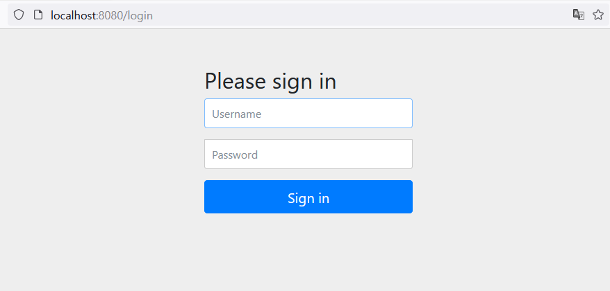
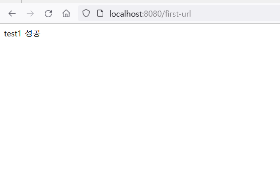

# 중간에 만난 Error들

## 1. localhost:8080에서 로그인 하라고 함

### 1. 에러 분석



<br>
<br>

+ 계속 로그인 하라는 무한루프에 빠져서 나오지를 못하였음,
+ 다른 사람들은 오라클DB 문제 라고 했지만, 난 오라클을 사용한 적은 있지만, 컴퓨터를 3번이나 포멧하여 사용 했었기에 아니었다.

..그래서 같이 배우는 친구랑 계속 찾다가 원인을 드디어 찾았다!

<br>
<br>

### 2. 에러 해결

https://p-kyung.tistory.com/37

+ 고마운 분의 도움으로 해결을 할 수 가 있었다.


+ 원인은 **implementation 'org.springframework.boot:spring-boot-starter-security'**


+ 써큐리티가 원인으로 이걸 주석 처리 되니까 해결 되는 것을 볼 수가 있었다..

<br>
<br>
 ++ 나중에 강의 뒤에서 왜 그런지 설명을 하셨다.. 

나중에서야 삽질을 했다는 것을 깨달음..

하아..

사람 말은 끝까지 듣자..

```
import org.springframework.context.annotation.Configuration;
import org.springframework.security.config.annotation.web.builders.HttpSecurity;
import org.springframework.security.config.annotation.web.configuration.EnableWebSecurity;
import org.springframework.security.config.annotation.web.configuration.WebSecurityConfigurerAdapter;

@Configuration
@EnableWebSecurity
public class SecurityConfig extends WebSecurityConfigurerAdapter {
  
  @Override
  protected void configure(HttpSecurity http) throws Exception{
    
    http.authorizeHttpRequests()
        .anyRequest().permitAll();
  }
}

```

<br>
<br>

### 3. 에러 해결 분석 성공!



<br>
<br>

## 2. @Controller 와 @RestController 의 차이

### 에러 분석


<br>
<br>

Spring MVC의 DispatcherServlet에서 "Circular view path" 오류가 발생하였다.

몰라서 나중에 좀더 자세히 찾아보고 물어보니까

컨트롤러만 붙이는 것은 서비스레이어 사용하는 주체한테 붙기 때문에 현재와 같이 뷰네임으로 페이지 이동하는 경우가 아니라면 (스트링이나 제이슨 데이터같이) 현재처럼 쓰는게 맞다고 한다.


##  **@Controller 와 @RestController 의 차이**


+ @Controller와 @RestController의 차이점은 용도의 차이라고 말할 수 있다고 생각합니다.


+ @Controller 어노테이션은 공식적으로 Spring 2.5 버전에서 추가되었고, @RestController는 Spring 4.0 버전에서 추가되었습니다.


+ 과거에는 JSP, HTML과 같은 View를 전달해 주었기에 주로 @Controller를 사용했고, 최근에는 Frontend / Backend을 나누어 개발하는 경우가 많기에 Backend에서 Rest Api를
  통해 JSON으로 데이터만 전달하기 때문에 편리성을 위해 @RestController를 사용한다고 합니다.


